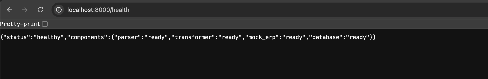
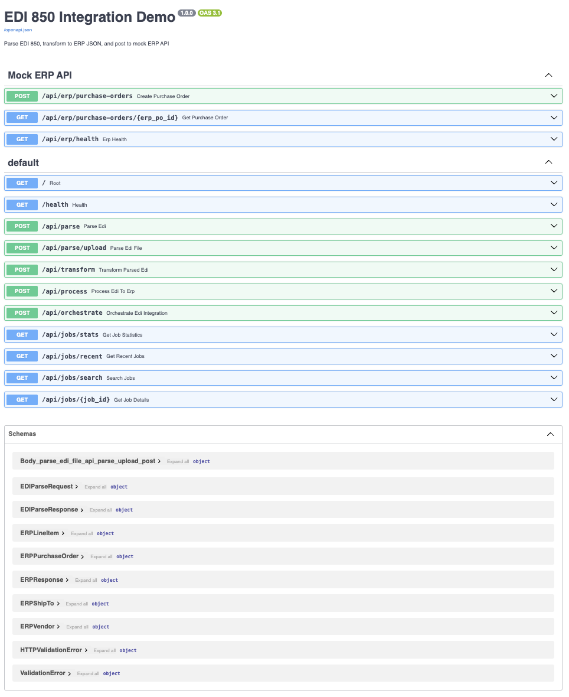
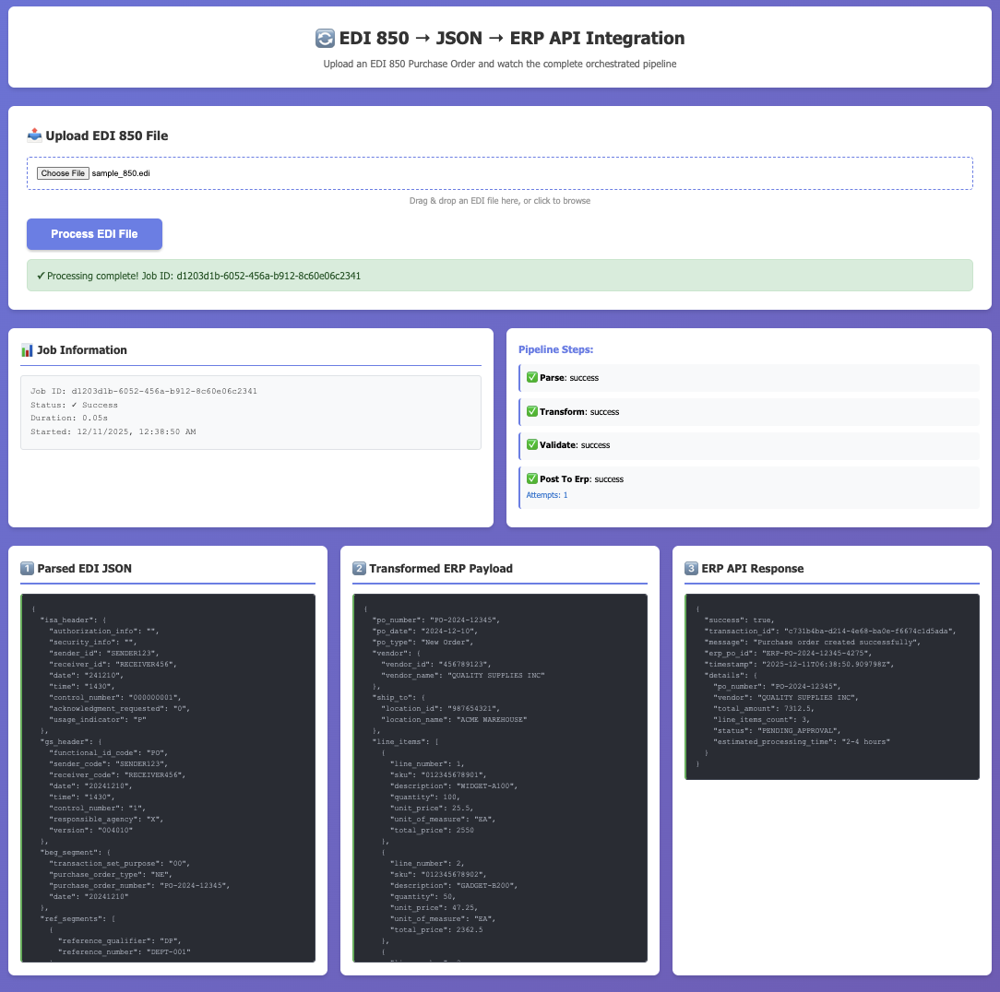

# EDI 850 → JSON → ERP API Integration

> End-to-end EDI 850 → ERP API integration pipeline simulating how suppliers ingest purchase orders, transform them into ERP-ready data, and submit them into modern API-driven systems.

---

## Project Overview

This project showcases a modern EDI integration workflow:

1. **Parse** — EDI 850 Purchase Orders → Structured JSON
2. **Transform** — EDI JSON → ERP API Schema
3. **Post** — Send to Mock ERP API
4. **Log** — Track results, errors, and retries
5. **Display** — Simple UI to visualize the pipeline

---

## Architecture

```
┌─────────────┐      ┌──────────────┐      ┌─────────────┐      ┌──────────┐
│  EDI 850    │ ───▶ │  EDI Parser  │ ───▶ │ Transformer │ ───▶ │ ERP API  │
│  Raw File   │      │  (Custom)    │      │  (Mapper)   │      │  (Mock)  │
└─────────────┘      └──────────────┘      └─────────────┘      └──────────┘
                            │                      │                   │
                            └──────────────────────┴───────────────────┘
                                              │
                                         ┌────▼─────┐
                                         │  SQLite  │
                                         │   Logs   │
                                         └──────────┘
```

---

## Tech Stack

| Component | Technology |
|-----------|-----------|
| **Backend** | Python + FastAPI |
| **EDI Parser** | Custom lightweight parser |
| **Database** | SQLite |
| **Frontend** | Vanilla HTML/CSS/JS |
| **API** | RESTful + JSON |

---

## Project Structure

```
edi-850-json-erp-api-demo
│
├── backend/
│   ├── main.py                   # FastAPI entry point
│   ├── config.py                 # Configuration settings
│   ├── requirements.txt          # Python dependencies
│   │
│   ├── edi_parser/              # EDI 850 parsing logic
│   ├── transformer/             # JSON transformation layer
│   ├── mock_erp_api/            # Mock ERP endpoints
│   ├── processor/               # Integration orchestrator
│   └── db/                      # SQLite persistence
│
├── frontend/
│   ├── index.html               # Main UI
│   ├── style.css                # Styling
│   └── app.js                   # Upload + display logic
│
├── sample_data/
│   └── sample_850.edi           # Test EDI file
│
└── logs/                        # Runtime logs
```

---

## Real-World Business Context

In modern supply chain operations, many organizations are transitioning from legacy EDI-only workflows to API-driven ERP and fulfillment platforms.

While EDI documents such as the X12 850 Purchase Order remain the primary method of exchanging orders with large retailers and distributors, downstream systems increasingly expect clean, structured JSON payloads delivered via REST APIs.

This project simulates how EDI purchase orders are processed in real production environments before being accepted into ERP systems.

---

### Example Scenario

A mid-market supplier receives an inbound EDI 850 Purchase Order from a retail trading partner.

To fulfill the order, the supplier must:

1. Parse the raw X12 document into a structured, machine-readable format  
2. Normalize and transform EDI data into the ERP’s expected schema  
3. Validate required fields, quantities, identifiers, and business logic  
4. Submit the purchase order to an ERP system via a REST API  
5. Log results, handle errors, and retry failures when necessary  

This workflow is common when integrating EDI feeds with:
- Cloud ERPs
- Order management systems
- Warehouse management systems
- Custom fulfillment or inventory platforms

---

### What This Project Demonstrates

This demo models that real-world integration pipeline by implementing:

- Custom parsing of EDI 850 purchase orders into structured JSON  
- A transformation layer that maps EDI data into an ERP-ready API payload  
- A mock ERP REST API that validates and accepts purchase orders  
- An orchestration layer handling end-to-end processing, retries, and logging  
- A lightweight UI for uploading EDI files and inspecting results  

The goal is to reflect how EDI documents are operationalized inside modern integration architectures — not just validated or translated, but actively transformed and consumed by downstream systems.

---

### Why This Matters

In production environments, failures at this stage can result in:
- Orders not entering the ERP
- Fulfillment delays
- Inventory mismatches
- Manual rework and exception handling

By modeling this flow end-to-end, the project demonstrates how EDI integrations are designed to be resilient, observable, and compatible with API-first systems.

---

## Quick Start

### Prerequisites

- Python 3.8+
- pip

### Installation

```bash
# 1. Clone the repository
git clone <your-repo-url>
cd edi-850-json-erp-api-demo

# 2. Create virtual environment
python3 -m venv venv
source venv/bin/activate  # On Windows: venv\Scripts\activate

# 3. Install dependencies
pip install -r backend/requirements.txt

# 4. Run the application
./run.sh
```

### Access the Application

- **Frontend UI**: open `frontend/index.html` in your browser
- **API Docs**: `http://localhost:8000/docs`
- **Health Check**: `http://localhost:8000/health`

---

## Usage

1. Open the web UI
2. Upload an EDI 850 file (use `sample_data/sample_850.edi`)
3. View the parsed JSON structure
4. See the transformed ERP payload
5. Check the mock API response

---

## 📸 Screenshots

Below are key screenshots demonstrating the full functionality of the EDI 850 → JSON → ERP API Integration Demo.

---

### **1. Service Health Check**
Verifies that the backend API is running and reachable.



---

### **2. Auto-Generated API Documentation (Swagger UI)**
Shows the full FastAPI surface, available endpoints, and automatic schema documentation.



---

### **3. Web UI – File Upload Interface**
The lightweight frontend where users upload EDI 850 files for processing.


---

### **4. End-to-End Processing – EDI → JSON → ERP API Response**
This screenshot demonstrates the full pipeline:
- EDI 850 parsed into structured JSON  
- Transformed into ERP-ready schema  
- Submitted to the mock ERP API  
- API response displayed in the UI  



---

These screenshots visually validate the complete integration workflow and provide a clear overview of the system from UI to backend API.

---

## Key Concepts Demonstrated

- **EDI Parsing**: Understanding X12 structure, segments, loops
- **Data Transformation**: Mapping between different schemas
- **API Integration**: RESTful patterns, error handling, retries
- **Orchestration**: Pipeline design, logging, state management
- **Full-Stack Development**: Backend + Frontend + Database

---

## Contact

**Brian Hughes**

[GitHub](https://github.com/itsbrianhughes) | [LinkedIn](https://linkedin.com/in/b-hughes)

---

## License

MIT License - Feel free to use this project for learning and portfolio purposes.
